<p align="center">
  
</p>

<h1 align="center">HyperGym</h1>

<p align="center">
  <strong>小米手环 10 Pro × 小米手机的力量训练追踪系统</strong><br>
  手环上记录每一组，手机上看到每一天
</p>

<p align="center">
  
  
  
  
</p>

---

## 界面预览

<table>
<tr>
  <td>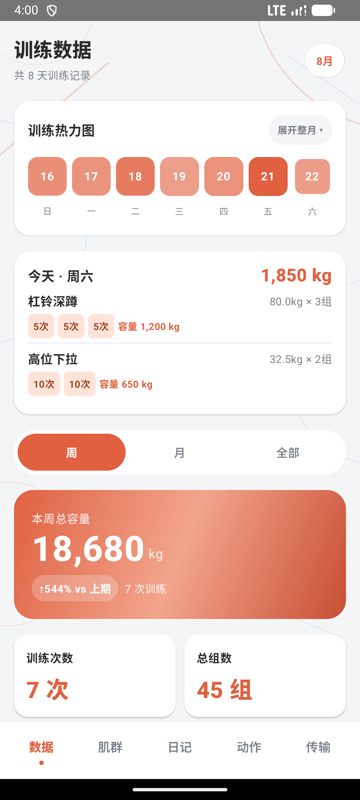</td>
  <td>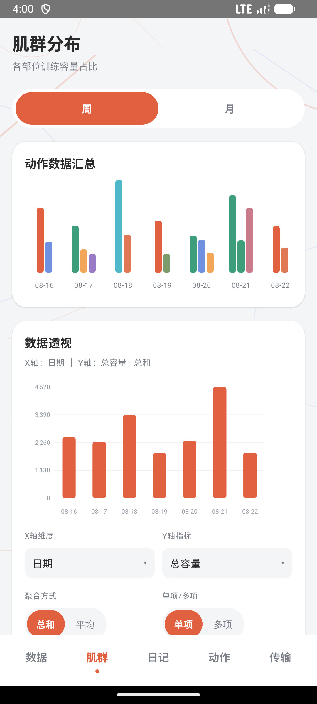</td>
  <td>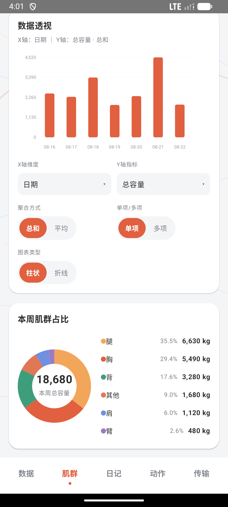</td>
</tr>
<tr>
  <td align="center">数据总览</td>
  <td align="center">肌群分析 · 动作汇总 + 数据透视</td>
  <td align="center">肌群分析 · 透视卡片 + 肌群占比</td>
</tr>
<tr>
  <td>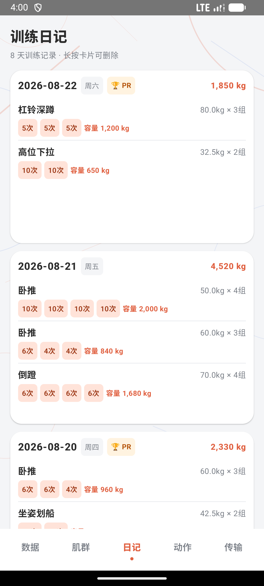</td>
  <td>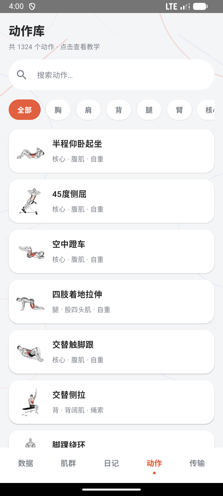</td>
  <td>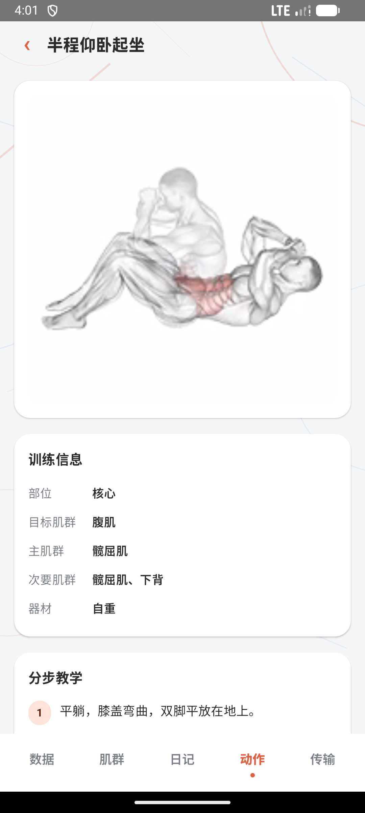</td>
</tr>
<tr>
  <td align="center">训练日记</td>
  <td align="center">动作库（1324 个动作）</td>
  <td align="center">动作详情（教学 + 视频）</td>
</tr>
<tr>
  <td>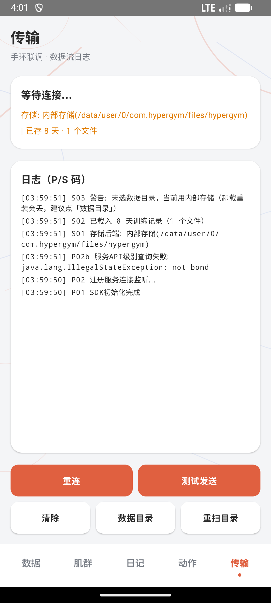</td>
  <td colspan="2" align="center">传输页（手环联调 · 数据流日志）</td>
</tr>
</table>

> 截图来自 Android 模拟器（内置示例训练数据），UI 为「暖橙 + 白卡 + 柔和阴影」风格。

---

## 这是什么？

HyperGym 是一套**手环 + 手机**协同的力量训练记录系统：

- **手环端**（小米手环 10 Pro / Vela OS）：在手环上选择动作、记录每组重量和次数，长按历史记录一键发送到手机。
- **手机端**（Android / HyperOS）：接收数据后，以暖橙白卡风格的现代 UI 展示训练统计、肌群分布、训练日记和 1324+ 个标准动作的教学库。

当前版本：**手机端 v3.1.10**（versionCode 17） / **手环端 v1.0.67**（versionCode 67），底部 5 个页签：**数据 / 肌群 / 日记 / 动作 / 传输**。

> ⚠️ **手环 rpk 的签名方式已定死，禁止修改。**
> 一旦 rpk 的签名与手机 APK 不一致，两个设备会**彻底无法通信**，而且这个问题**不留任何源码痕迹**。
> 动手前请先读 [`SIGNING.md`](SIGNING.md)。

`demo-package/` 下是本机打好的安装包（**不入库**，见 `.gitignore`）：`HyperGym-release.rpk`（手环）、`HyperGym-Phone-debug.apk`（手机）。用根目录的 `build-debug.ps1` 一键重新产出。
---

## 功能特性

### 📊 数据总览（数据页）


- **训练热力图**：周历 + 「展开整月」月历网格。色阶按**名次**分 4 档**实色**（不是"当天 ÷ 最大值"），所以即使各天数据很接近也能一眼看出多少——否则只要有一天特别猛，其余天就全被压成同一片浅色。未训练用**冷灰**、已训练用**暖橙**，靠**色相**区分而不只是明暗。卡片内只有热力图本身，不加任何说明文字。
- **当天训练卡片**：展示所选日期的动作明细 + 当日总容量。**同一动作的不同重量合并在一块**——动作名只出现一次，组内按重量分行（每行左侧重量、右侧该重量的容量，下方是该重量的次数标签），右侧给出该动作的组数与合计容量，不再重复占行。
- **范围切换**：周 / 月 / 全部（pills），切换上方英雄卡与统计。
- **英雄卡**：本周/本月总容量 + 环比趋势（↑/↓ vs 上期）。
- **统计卡片**：训练次数、总组数等关键指标。

### 💪 肌群分析（肌群页）


- **动作数据汇总**：按天分组的**细柱状图**，同一天不同动作不同色；**默认滚动到最右端**（优先显示最近几天，而不是最早的几天）；**点击某一天的柱状图**，卡片底部按当天数据显示图例（可换行，两行内完整展示），再点可收起。
- **数据透视卡片**（页面第 2 张卡，可自定义）：像数据透视表一样组合维度与指标——
  - **X轴维度**：日期 / 周 / 肌群 / 动作
  - **Y轴指标**：总容量 / 总组数 / 总次数 / 平均重量 / 平均次数
  - **聚合方式**：总和 / 平均
  - **单项 / 多项**：单项显示一条汇总序列；多项按「明细维度」（动作 / 肌群）拆成多条彩色序列
  - **图表类型**：柱状 / 折线，**柱从底部生长、折线从左向右展开**的微动画
  - **横轴只标首尾两个日期**：数据一多逐点标注会全部挤在一起，中间的点改为点击查看
  - **点击图上任意一根柱/点**：下方直接列出该点各序列的数值（再点一次取消选中），并在图上高亮该点的竖线与圆点
  - **默认显示最近的数据**：数据变化后自动滚到最右端
  - 所有选项都在卡片底部以上拉/分段控件选择


- **区间切换**：**周 / 月 / 全部**，按**自然周期**取——**周 = 本周一 ~ 周日**，**月 = 本月 1 号 ~ 月末**，**全部 = 全部历史数据**。选「全部」时，下面的数据透视与肌群占比都改用全部数据一起分析。
- **肌群占比**：甜甜圈图 + 各肌群占比清单（容量 + 百分比），与上述卡片共用一套配色；标题随区间变为「本周 / 本月 / 全部肌群占比」。

### 📖 训练日记（日记页）


- 按日期倒序展示每天训练详情，每张卡片**完整显示 3 个动作**，超出部分**卡片内上下滚动**。
- 与数据页保持一致：**同一动作的不同重量合并在一块**显示，动作名不再重复出现。
- **PR（个人纪录）徽章**自动识别并标记。
- **长按卡片晃动 + 右上角红色 ✕**：可删除错误记录；再长按一次退出删除状态。删除后**数据 / 肌群 / 日记页联动刷新**，对应日期的 JSON 行也从 `records-NNNN.jsonl` 数据文件中同步移除。

### 🏋️ 动作库（动作页）


- 内置 **1324+ 个标准健身动作**（**纯中文**名称 + 分步教学），与手环动作列表**完全解耦**。
- 支持按肌群分类筛选（全部 / 胸 / 肩 / 背 / 腿 / 臂 / 核心 / 有氧 / 颈）+ 关键词搜索。
- 点击动作进入详情：**训练信息**（部位 / 目标肌群 / 主肌群 / 次要肌群 / 器材）+ **分步教学** + **ExoPlayer 无缝循环视频**演示。


### 📡 数据传输（传输页，原「诊断」）


- 蓝牙连接状态实时显示。
- **P/S 调试码日志**，方便排查（P01-P17 / S01-S08 等）。
- **SAF 安全目录存储**（卸载重装数据不丢）为主，内部存储兜底。
- 操作按钮：重连 / 测试发送 / 清除 / 数据目录 / 重扫目录。

---

## 手环端界面（Vela 快应用）

手环端为 `miband10pro-trainer`（Vela OS 快应用，`com.hypergym`，versionName **1.0.67**，versionCode 67）。主界面是一个横向滑动容器，**左右滑动切换 5 屏**。

<table>
<tr>
  <td>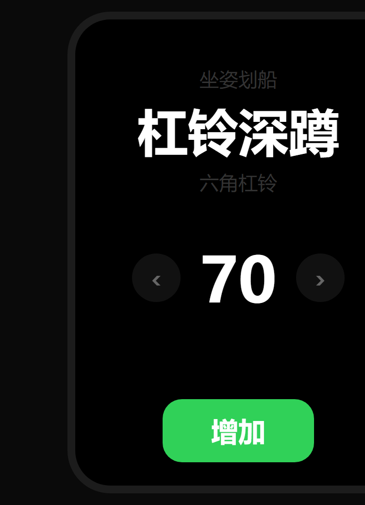</td>
  <td>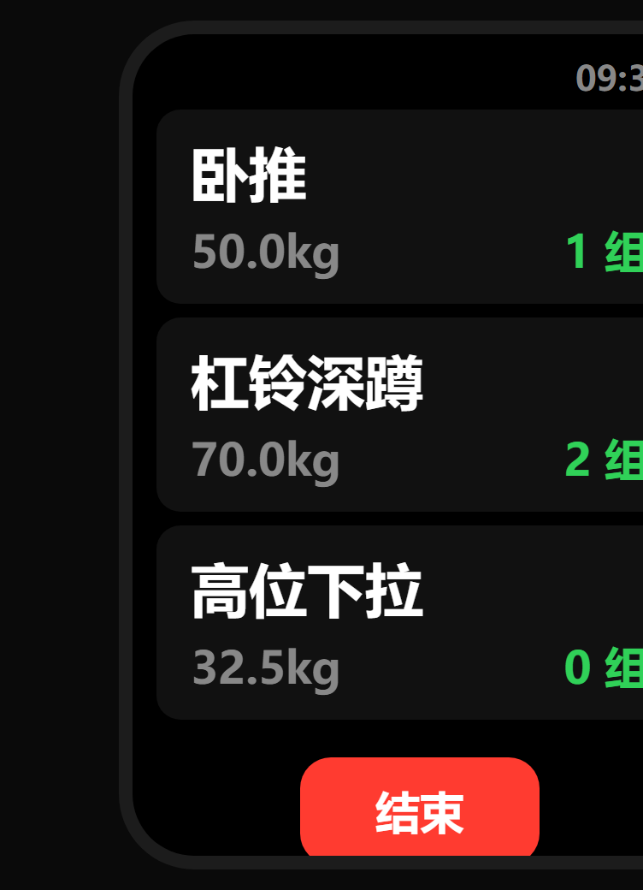</td>
  <td>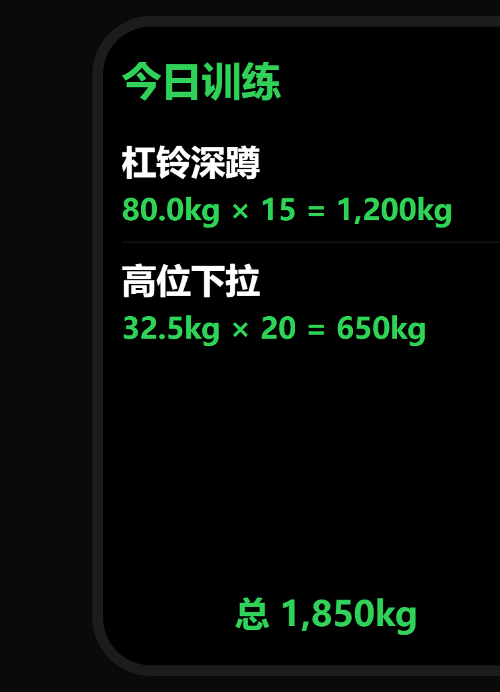</td>
</tr>
<tr>
  <td align="center">屏0 · 计划</td>
  <td align="center">屏1 · 记录列表</td>
  <td align="center">屏2 · 今日数据</td>
</tr>
<tr>
  <td>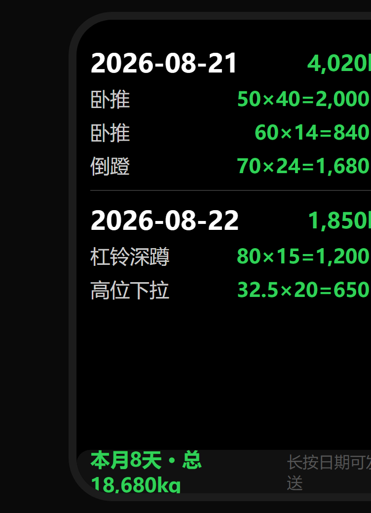</td>
  <td>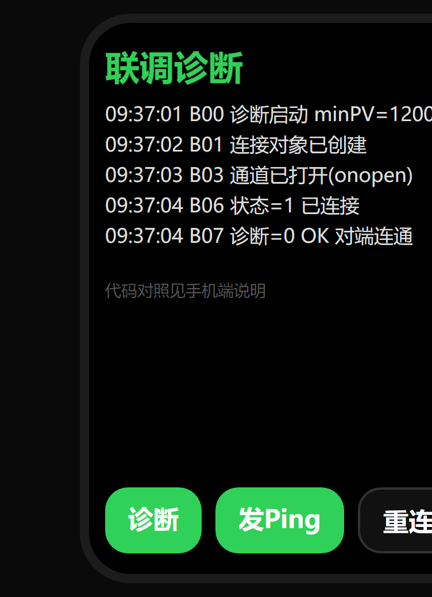</td>
  <td>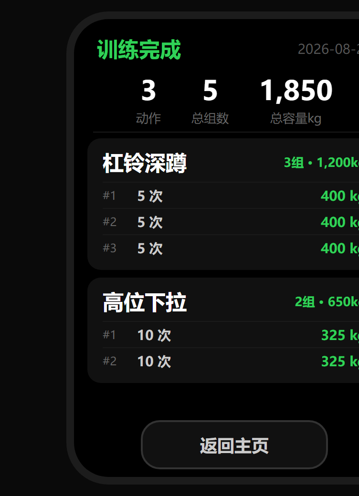</td>
</tr>
<tr>
  <td align="center">屏3 · 历史</td>
  <td align="center">屏4 · 联调诊断</td>
  <td align="center">训练完成 · 汇总</td>
</tr>
</table>

> 界面图按 `.ux` 源码精确还原（黑底 + 绿色主操作色），数据为示例。

- **屏0 · 计划**：**两级菜单**——左半屏上下滑动切换部位，右半屏上下滑动切换该部位下的动作（共 26 个动作）；左右加减重量（按各动作步进）；自重类动作最左端是「自重」档（字号比数字小一号，视觉大小与数字对齐）；「增加」加入计划。
- **屏1 · 记录列表**：显示已加入计划的项目与已完成组数；点击项目开始计次（`-` / 次数 / `+` / 确认 / 取消）；长按项目编辑重量（`- / +` / 确定 / 删除）；「结束」保存并进入汇总。
- **屏2 · 今日数据**：今日各动作的训练明细 + 当日总容量。
- **屏3 · 历史**：按日期列出历史训练（每条含动作与容量），底部「本月 X 天 · 总 Xkg」；**长按日期即发送当天数据到手机**。
- **屏4 · 联调诊断**：B00/B01… 调试码日志 +「诊断 / 发Ping / 重连」按钮，用于排查互联互通。
- **训练完成 · 汇总**：记录结束后展示本次「动作 / 总组数 / 总容量」+ 每个动作的逐组明细，「返回主页」。

---

## 系统架构

```
┌──────────────────────────────┐
│     小米手环 10 Pro          │
│     (Vela OS 快应用)         │
│                              │
│  选择动作 → 输入重量/组数    │
│  → 本地保存 → 长按发送      │
└──────────┬───────────────────┘
           │  @system.interconnect
           │  (XMS Wearable SDK)
           ▼
┌──────────────────────────────┐
│     Android 手机 App          │
│     (Kotlin + Compose)       │
│                              │
│  接收 JSON → 按日期去重      │
│  → JSONL 分片存储 (30条/片)  │
│  → Compose UI 实时渲染       │
│                              │
│  数据 · 肌群 · 日记          │
│  动作 · 传输                 │
└──────────────────────────────┘
```

---

## 技术栈

| 组件 | 技术 | 版本 |
|---|---|---|
| **手机端 UI** | Jetpack Compose + Material 3 | BOM 2025.05.01 |
| **图表** | Canvas 自绘柱状图 / 甜甜圈图 / 折线图（Charts.kt / PivotCard.kt） | — |
| **视频播放** | Media3 ExoPlayer（硬解无缝循环） | 1.4.1 |
| **数据传输** | xms-wearable-lib（XMS Wearable SDK） | 1.4 |
| **数据存储** | SAF 目录 + JSONL 分片文件（每片 30 行） | — |
| **手环端** | Vela OS 快应用（aiot-toolkit） | 2.0.5 |
| **开发语言** | Kotlin 2.1 / JavaScript (快应用) | — |
| **构建工具** | Gradle + AGP | 8.2 / 8.2.2 |
| **最低 Android** | minSdk 21 (Android 5.0) | — |
| **应用版本** | 手机 3.1.10 / versionCode 17 ｜ 手环 1.0.67 / versionCode 67 | — |

---

## 项目结构

```
hypergym/
├── phone-app/                      # 手机端 Android 项目
│   ├── app/
│   │   ├── build.gradle            # 依赖配置
│   │   └── src/main/
│   │       ├── java/com/hypergym/
│   │       │   ├── MainActivity.kt      # 蓝牙连接 + 数据接收
│   │       │   ├── data/
│   │       │   │   ├── TrainingData.kt   # 数据模型 + JSON 解析
│   │       │   │   ├── RecordStore.kt    # 存储引擎（分片/去重/压缩/删除）
│   │       │   │   ├── DataBackend.kt    # 存储后端抽象（SAF / 内部）
│   │       │   │   ├── StatsEngine.kt    # 统计引擎（纯函数）
│   │       │   │   ├── MuscleMap.kt      # 动作 → 肌群映射
│   │       │   │   └── ExerciseLibrary.kt # 动作库加载 + 中文翻译
│   │       │   └── ui/
│   │       │       ├── HyperGymApp.kt    # 根界面（5 Tab + Pager）
│   │       │       ├── Theme.kt          # 暖橙主题色 + 装饰背景 + 统一调色板
│   │       │       ├── DashboardScreen.kt # 数据页（热力图/英雄卡/趋势）
│   │       │       ├── MuscleScreen.kt   # 肌群页（动作汇总/肌群占比）
│   │       │       ├── PivotCard.kt      # 数据透视卡片（自定义 X/Y）
│   │       │       ├── DiaryScreen.kt    # 日记页（长按删除 + 3 动作卡片）
│   │       │       ├── ExerciseScreen.kt # 动作库（搜索/视频/教学）
│   │       │       ├── Charts.kt         # Canvas 自绘图表组件
│   │       │       ├── Components.kt     # 通用 UI 组件
│   │       │       └── DateUtils.kt      # 日期工具
│   │       └── assets/
│   │           └── exercises/            # 动作库资源
│   │               ├── exercises.json    # 1324 个动作数据
│   │               ├── videos/          # 动作演示视频
│   │               └── images/          # 动作缩略图
│   └── libs/                             # xms-wearable-lib.aar
│
├── miband10pro-trainer/            # 手环端 Vela 快应用
│   ├── src/
│   │   ├── manifest.json           # 快应用清单（package: com.hypergym）
│   │   ├── common/data.js          # 26 个训练动作定义（按部位分组）
│   │   └── pages/home/             # 首页 UI
│   └── package.json
│
├── 健身动作库/                      # 原始动作库（1324 个动作 + 视频 + 图片）
├── ui-prototype/                    # Web UI 原型（暖橙白卡风格）
├── ui-refs/                         # 参考设计图
├── screenshots/                     # 本 README 用到的界面截图
├── logo/                            # App 图标
├── .gitignore                       # Git 忽略规则
└── README.md                        # 本文件
```

---

## 快速开始

### 手机端（Android App）

**环境要求：**

- JDK 21
- Android SDK（compileSdk 36, buildTools 36.1.0）
- Gradle 8.2

**构建步骤：**

```bash
# 进入手机端项目目录
cd phone-app

# 设置环境变量（Linux/Mac）
export JAVA_HOME=/path/to/jdk21
export ANDROID_HOME=/path/to/android-sdk

# 构建 Release APK
./gradlew assembleRelease

# APK 输出路径
# phone-app/app/build/outputs/apk/release/app-release.apk
```

> Windows 用 `gradlew.bat` 替换 `./gradlew`。

### 手环端（Vela 快应用）

**环境要求：**

- Node.js >= 8.10
- aiot-toolkit >= 2.0.5

**构建步骤：**

```bash
cd miband10pro-trainer
npm install
npm run release  # 发布 rpk 包（必须用 release，见下方警告）
```

> ⚠️ **装到手环上的 rpk 不要用 `npm run build` 打包。**
> `aiot` 在 development 模式下，若找不到 `sign/debug/` 与 `sign/private.pem`，会**静默回退到
> aiot-toolkit 自带的调试证书**去签名。这样打出的 rpk 与手机 APK 签名不一致，
> 手环与手机会**彻底无法通信**（`system.interconnect` 直接拒绝握手），而且这个问题
> **源码 diff 查不出来**（证书不在源码里）。只有 `release`（production 模式）才会用
> `sign/release/` 里那张与手机一致的证书。详见 [`SIGNING.md`](SIGNING.md)。

### 一键构建双端（本机）

仓库根目录的 `build-debug.ps1` 封装了本机构建链（`.research/` 内的 JDK 21 / Gradle / Android SDK）：

```powershell
.\build-debug.ps1 -Only band -Bump    # 只构建手环端并递增版本
.\build-debug.ps1 -Only phone -Bump   # 只构建手机端并递增版本
.\build-debug.ps1                     # 双端都构建
```

脚本在构建前会**强制校验手环证书与手机 APK 证书的指纹一致**，不一致直接中止；
构建后还会扫描 aiot 日志，确认没有落到 toolkit 内置证书。产物统一输出到 `demo-package/`。

---

## 数据流详解

### 传输协议（手环 → 手机）

手环通过 `@system.interconnect` 发送 JSON：

```json
{
  "type": "training-records",
  "date": "2026-08-15",
  "records": [
    {
      "exercise": "杠铃深蹲",
      "weight": 80,
      "sets": [
        { "set": 1, "reps": 8, "volume": 640 },
        { "set": 2, "reps": 8, "volume": 640 },
        { "set": 3, "reps": 6, "volume": 480 }
      ]
    }
  ]
}
```

### 存储机制

- **合并**：以 `date` 定位当天，再按 **(动作名, 重量)** 合并——payload 里出现的键与既有条目**合并组列表**，payload 里没有的键**原样保留**。
  于是「同一天分多次传输」会**累加**（先传 7 个动作、再传 3 个 → 共 10 个），而「重复发送同一份」是**幂等**的（不会翻倍）。
  *（旧版是"同日期后到覆盖先到"，会把先传的数据整体抹掉——这正是曾经丢数据的根因。）*
- **分片**：每 30 条记录一个 `records-NNNN.jsonl` 文件，写满自动开新片。
- **压缩**：超过 1200 行自动重写（去重后重新分片）。
- **持久化**：SAF 目录（用户授权的公共文件夹），卸载重装数据不丢。
- **删除联动**：日记页删除某天记录后，内存索引 + 数据文件同步重写，数据/肌群页图表立即刷新。

---

## 手环内置动作（26 个）

来源：`miband10pro-trainer/src/common/data.js`。「自重档」表示该动作最左端多一个「自重」档（下标 0），
其后才是正常配重。

| 部位 | 动作 | 重量范围 (kg) | 步进 (kg) | 自重档 |
|---|---|---|---|---|
| 胸 | 卧推 | 40 – 90 | 5 | |
| 胸 | 水平胸推 | 20 – 90 | 5 | |
| 胸 | 下斜胸推 | 20 – 90 | 5 | |
| 胸 | 坐姿飞鸟 | 10 – 50 | 2 | |
| 胸 | 双杠臂屈伸 | 10 – 60 | 5 | ✓ |
| 肩 | 哑铃 | 10 – 60 | 2 | |
| 肩 | 侧平举 | 10 – 60 | 2 | |
| 肩 | 坐姿肩推 | 20 – 50 | 5 | |
| 肩 | 面拉 | 20 – 60 | 2 | ✓ |
| 背 | 高位下拉 | 20 – 60 | 2 | |
| 背 | 大剪刀 | 20 – 90 | 5 | |
| 背 | 高位划船 | 20 – 90 | 5 | |
| 背 | 坐姿划船 | 20 – 60 | 2 | |
| 背 | 俯身划船 | 20 – 60 | 5 | |
| 背 | 轨道划船 | 20 – 60 | 2 | |
| 背 | 引体向上 | 10 – 30 | 5 | ✓ |
| 腿 | 哈克深蹲 | 20 – 90 | 5 | |
| 腿 | 杠铃深蹲 | 40 – 80 | 5 | |
| 腿 | 倒蹬 | 30 – 60 | 5 | |
| 腿 | 髋外展 | 20 – 60 | 2 | |
| 腿 | 髋内收 | 20 – 60 | 2 | |
| 腿 | 髋伸展 | 20 – 60 | 2 | |
| 腿 | 腿弯曲 | 10 – 60 | 5 | |
| 核心 | 卷腹 | 10 – 50 | 5 | ✓ |
| 核心 | 罗马椅 | 10 – 30 | 5 | ✓ |
| 臂 | 牧师椅 | 10 – 60 | 2 | |

> 手机端动作库（1324 个动作）与手环动作列表**完全解耦**，手机端动作库是一个独立的参考教学页面。

---

## 设计语言

**暖橙 + 白卡 + 柔和阴影**（区块化）

| 元素 | 色值 | 用途 |
|---|---|---|
| Primary | `#E06040` | 按钮、图表高亮、容量数字 |
| PrimaryDeep | `#C84E32` | 渐变尾部 |
| PrimaryLight | `#F2A58D` | 渐变中间 |
| Blue | `#7090E0` | 辅助图表 |
| Green | `#3E9E7B` | 正向/达标 |
| Background | `#F4F5F7` | 页面底色 |
| Card | `#FFFFFF` | 白色卡片（纯白） |

所有图表的分类配色使用同一套 `ChartPalette`，保证同页各卡片风格一致。

---

## 更新记录

### 手机端 v3.1.10（versionCode 17） ｜ 手环端 v1.0.67（versionCode 67）

**修复（本轮重点）**

- 🐞 **同一天分多次传输的数据会被覆盖** —— 旧版以 `date` 为主键、后到的整天数据**整体替换**先到的，
  于是"先传 7 个动作、再传 3 个"之后，前面 7 个就消失了。
  现在改为按 **(动作名, 重量)** 合并，且同键的「组」也做合并：
  - 分两次传、动作不同 → **累加**（7 + 3 = **10**）
  - 重复发同一份 → **幂等**，不会翻倍
  - 手环中途丢了数据（发来的比手机上少）→ 手机上已有的组**不会被吃掉**
  - 从磁盘重建索引时把同一日期**所有历史行逐行折叠合并**（旧版是后者覆盖前者），
    这也能把历史上被"覆盖语义"遮蔽、但文件里其实还在的数据找回来
- 🐞 **肌群页「周 / 月」用的是滚动窗口而非自然周期** —— 旧版「周」= 最近 7 天、「月」= 最近 30 天。
  现改为自然周期：**周 = 本周一~周日**，**月 = 本月 1 号~月末**，**全部 = 全部数据**。

**改进**

- **热力图配色重做**：由"连续透明度 + 除以最大值"改为**按名次分 4 档的实色填充**，
  数据接近时也能看出差别；卡片的图例与说明文字一并移除，**卡片内只保留热力图本身**；
  日期数字颜色不变（已训练始终白字，对比度实测 3.15 / 3.55 / 4.57 / 6.38 : 1，全部达标）。

**手环端**

- 🐞 **读文件失败被静默当成空库，下一次保存会把磁盘上的数据整份覆盖**
  现在解析失败会置保护位并**拒绝保存**（宁可本次保存失败，也不覆盖原文件）；
  "文件不存在"（首次使用）不受影响，不置保护位。

**文档**

- README 与本轮实现同步（版本号、热力图说明、区间语义、存储合并规则）
- `REVIEW.md` 重写：按「严重级别 × 手机端 / 手环端」重组，每条给出**怎么触发 → 你会看到什么 → 真正的后果 → 代码证据 → 修复建议 → 当前状态**

### 手机端 v3.1.5（versionCode 12） ｜ 手环端 v1.0.66（versionCode 66）

**手机端**

- **数据页**：同一动作的不同重量**合并显示**——动作名只出现一次，组内按重量分行并给出该动作的合计，不再重复占行
- **日记页**：同样合并同动作不同重量，与数据页**共用同一套渲染**（逻辑抽到 `Components.kt`）
- **肌群页 · 区间**：新增 **「全部」**，数据透视与肌群占比可一起吃全量数据一起分析
- **肌群页 · 动作数据汇总**：**默认显示最近的数据**（自动滚到最右端，而非最早的几天）
- **肌群页 · 数据透视**：**横轴只标首尾两个日期**（避免数据多时全部挤在一起）；**点击图上任意柱/点即可查看该点的各序列数值**（再点取消，并高亮该点）；同样默认显示最近的数据

**手环端**

- **屏0**：自重类动作的「自重」档字号 64px → 48px，与后面的重量数字视觉大小对齐
- 动作列表为**两级菜单**（左半屏切换部位 / 右半屏切换动作），共 26 个动作

**工程**

- 新增 `build-debug.ps1`：一条命令产出双端安装包，**构建前强制校验签名一致性**
- 手环端打包固定使用 `npm run release`（只有 production 模式才用与手机一致的正式证书）
- 🐞 **修复**：一度误用 `npm run build`，rpk 被 aiot-toolkit 内置调试证书签名，导致手环与手机**完全无法通信**；现已修复并加装强制校验，详见 [`SIGNING.md`](SIGNING.md)
- 二进制安装包不再入库（`.gitignore` 新增 `*.rpk`、`dist/`、`.temp_*/`）
- **开源协议改为 [MIT](LICENSE)**（新增 `LICENSE` 文件；`miband10pro-trainer/package.json` 增加 `"license": "MIT"`）

---

## 已知问题

- **手环端「训练完成 · 汇总」页不可达**：`pages/summary` 未注册进 `manifest.json` 路由，记录结束后实际切到的是屏 2「今日数据」，该页面目前是死代码。
- 手环端界面图为按 `.ux` 源码还原的示意图，非真机截图。

---

## 许可证

本项目采用 **[MIT License](LICENSE)** 开源。

```
MIT License

Copyright (c) 2026 conafun
```

> ⚠️ **例外**：`diag-band/`、`interconnect-demo-build/`、`miband10pro-trainer/node_modules/`、`.research/`
> 中可能包含小米官方示例代码与本机构建工具链，**不在本项目的 MIT 授权范围内**，版权归各自作者所有。
> 你在使用/再分发这些部分时，请遵守其原始授权条款。
